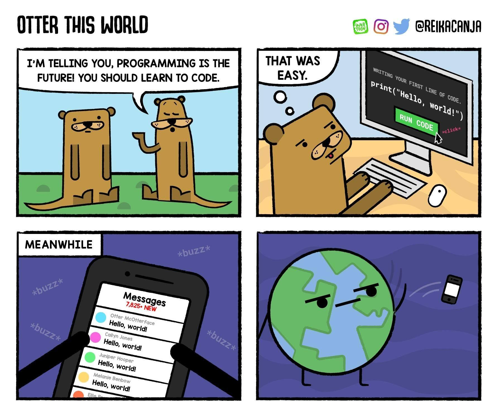

I don't plan to use the "blog posts" portion of the website much, but I'm going to go ahead and set it up in case I change my mind later. Since part of doing that is making sure that adding posts works, I might as well start with a traditional <a href="https://en.wikipedia.org/wiki/%22Hello,_World!%22_program" target="_blank">"Hello, World!"</a>.

<a href="https://www.webtoons.com/en/challenge/otter-this-world/ep-1-hello-world/viewer?title_no=74462&episode_no=1&webtoonType=CHALLENGE&fbclid=IwAR2lpOfvDixV6WVPDc1yAW-skvspfaqRpinfK0AeIwOAdxNpXG3ComyAGXY" target="_blank">"Otter This World"</a>
